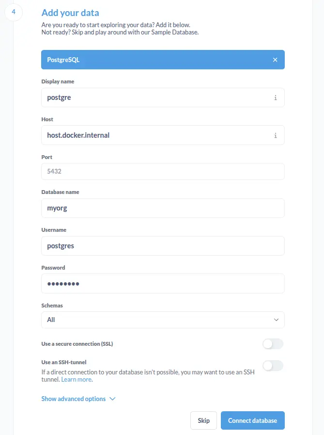

# Setting Up Metabase

Metabase is already set up in [Docker Compose](../docker/compose-metabase.yaml). Make sure you're finished with the requirements in [README.md](../README.md).

- Run Docker compose with pnpm

  ```sh
  pnpm compose:up
  ```

- Open http://localhost:3000

- Wait a couple minutes to let Metabase bootstrap itself

- On first access, you must create a local account in Metabase.

- Add the data warehouse PostgreSQL credentials to connect.

- If you want to use a database from `localhost`, input the host `host.docker.internal`.

See the image for default settings reference:


